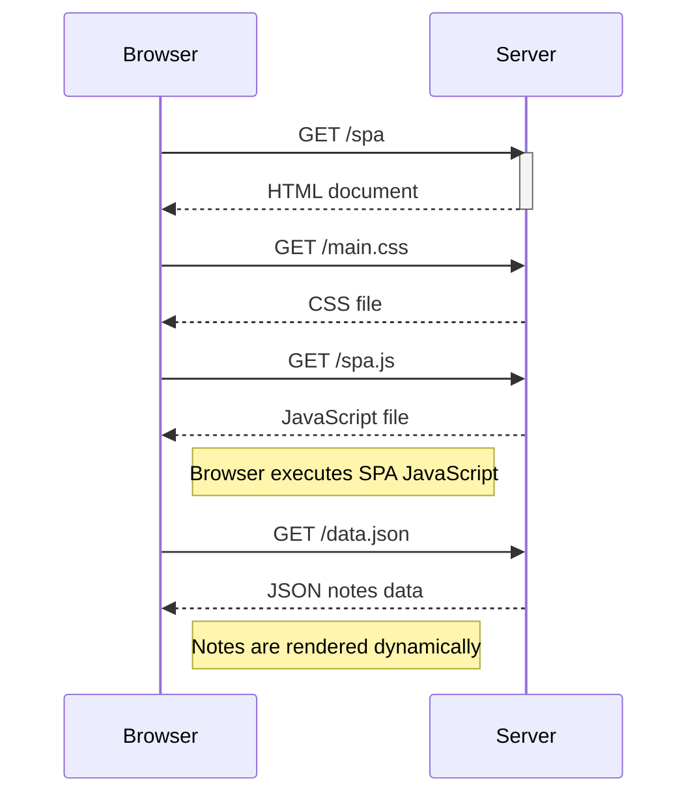

```mermaid
sequenceDiagram
    participant Browser
    participant Server

    Browser->>Server: GET /spa
    activate Server
    Server-->>Browser: HTML document
    deactivate Server

    Browser->>Server: GET /main.css
    Server-->>Browser: CSS file

    Browser->>Server: GET /spa.js
    Server-->>Browser: JavaScript file

    Note right of Browser: Browser executes SPA JavaScript

    Browser->>Server: GET /data.json
    Server-->>Browser: JSON notes data

    Note right of Browser: Notes are rendered dynamically
```
