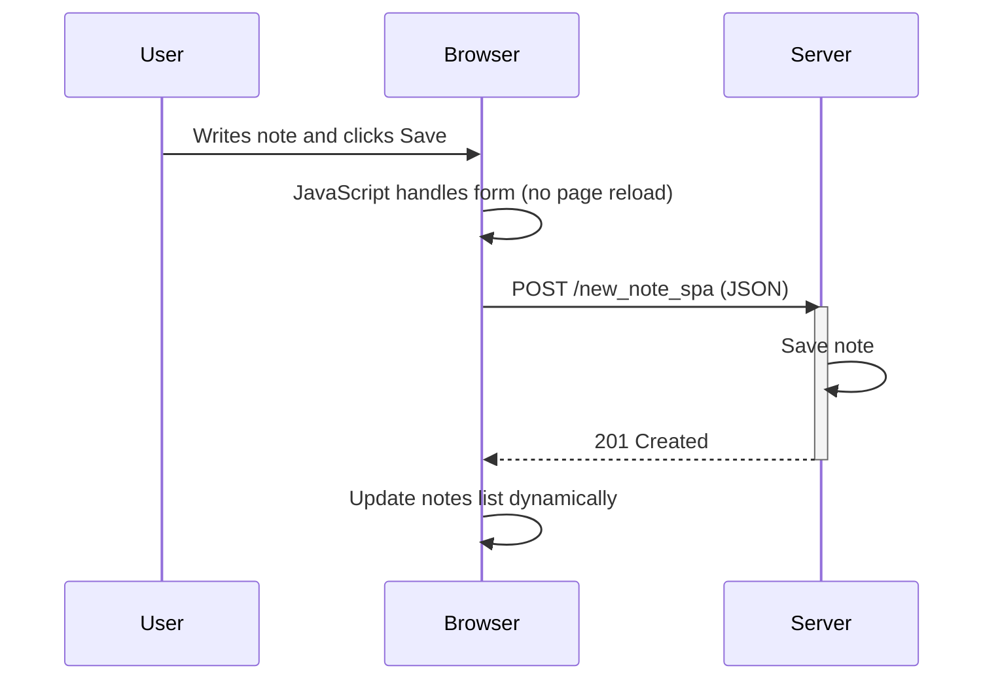

```mermaid
sequenceDiagram
    participant User
    participant Browser
    participant Server

    User->>Browser: Writes note and clicks Save
    Browser->>Browser: JavaScript handles form (no page reload)
    Browser->>Server: POST /new_note_spa (JSON)
    activate Server
    Server->>Server: Save note
    Server-->>Browser: 201 Created
    deactivate Server
    Browser->>Browser: Update notes list dynamically
```
